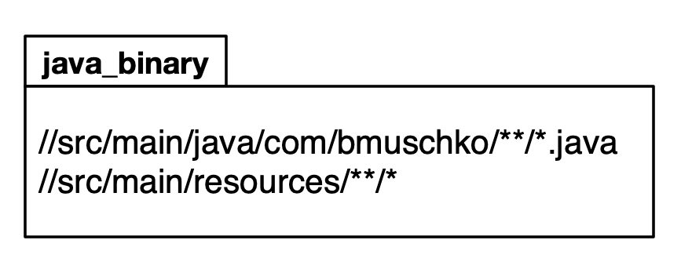

# Exercise 2

In this exercise, you will create the build logic for a Java-based project. The source code contains of a main class as the entrypoint of the program and a supporting set of classes. When executed, the program reads a properties file available on the classpath and prints the key-value pairs of the file to standard output. Reference the documentation of the [java_binary rule](https://docs.bazel.build/versions/main/be/java.html#java_binary) for more information.

The following image shows the high-level architecture.

1. Inspect the existing source code files in the `start` directory.
2. Add a `WORKSPACE` file and a `BUILD` file to the root directory of `start`.
3. Add relevant build logic that allows you to build the binary file for all source code in the project.
4. Run the main class `com.bmuschko.app.Application` of the compiled program. The program should render the key-value pairs `profile: production` and `version: 1.0.0` on the console.
5. Change the key-value pairs in the properties files. What do you expect to happen when executing the Bazel `run` command again?