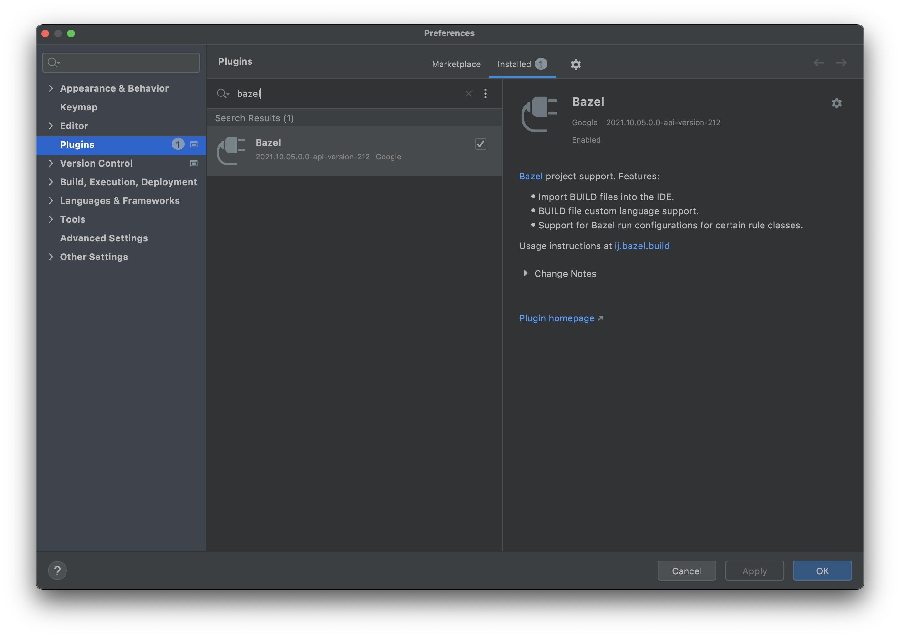
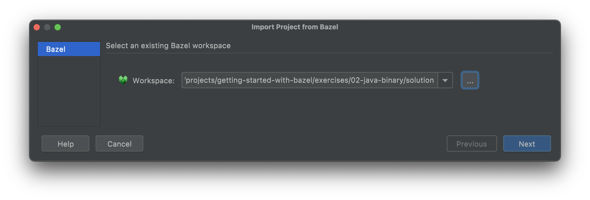
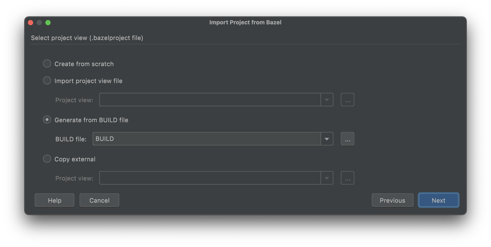
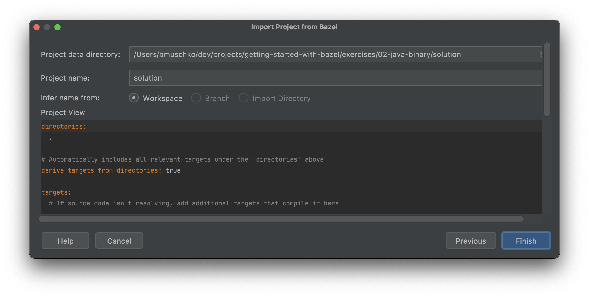
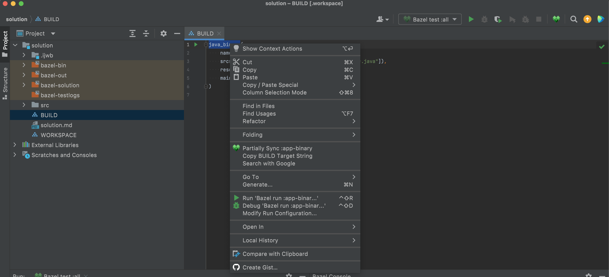
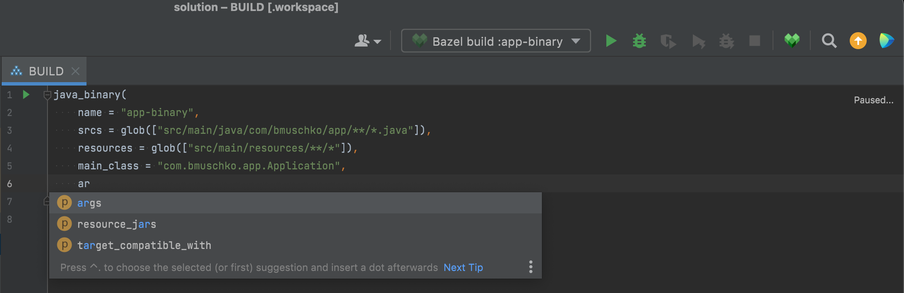

# Solution

## IntelliJ Plugin

The plugin can be installed from the menu item _IntelliJ IDEA > Preferences... > Plugins_. You can install updates at any time from the same location.

Start the project import process via _File > Import Bazel Project..._. Select the directory of your project.

Select the project view depending on the setup. Here, we are pointing to the `BUILD` file.

In the last step of the import process, you can provide a different name and finalize the import. Press the "Finish" button.

You can open the context menu for a rule by right-clicking on it in the editor view. The command can be changed in the run configuration dialog.

IntelliJ offers auto-completion upon typing within the context of a rule defined in a `BUILD` file.

