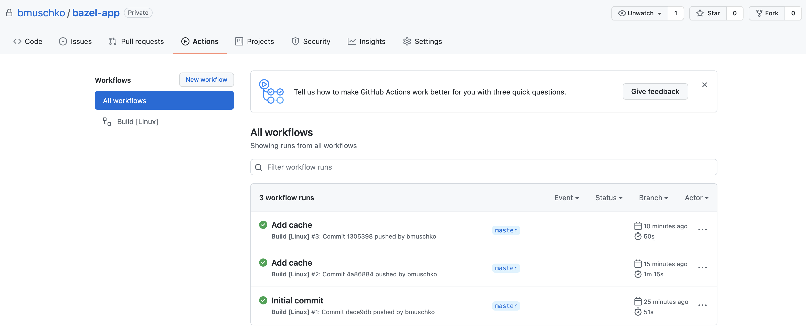

# Solution

Create the file `.bazelversion` in the root directory of the project so that Bazelisk can determine the required Bazel runtime version. The following file defines the version 4.2.1.

```
4.2.1
```

The workflow file in `.github/workflows` could look as follows. You can name the file anything you want that reflects the purpose of the build, e.g. `linux-build.yml`.

```
name: Build [Linux]
on: [push, pull_request]

jobs:
  build:
    name: Build
    runs-on: ubuntu-20.04
    steps:
      - name: Checkout
        uses: actions/checkout@v1
      - name: Install Bazel
        uses: bazelbuild/setup-bazelisk@v1
      - name: Mount Bazel cache
        uses: actions/cache@v2
        with:
          path: "~/.cache/bazel"
          key: bazel
      - name: Build
        run: bazel build //...
      - name: Test
        run: bazel test //...
```

Pushing the code will trigger a build. You can find the execution of the build in the "Actions" tab of your repository.

